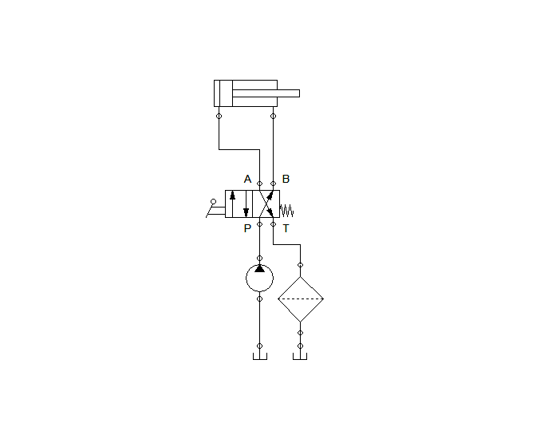
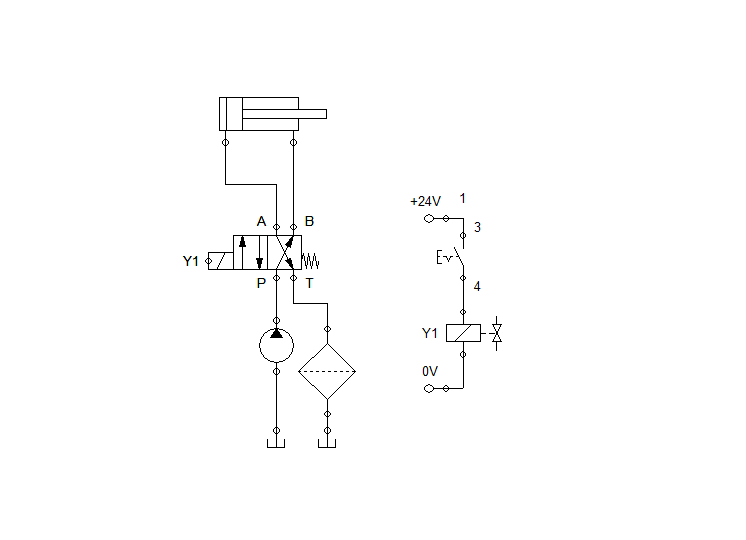

# 🛢 Double Acting Cylinder

## Overview

🔹 Creating a hydraulic diagram controlling a double acting cylinder using a lever and a solenoid.   
🔹 Combining hands-on work experience w/ theory.  

Controlling a 4/2 way valve using a **Lever**

Controlling a 4/2 way valve using a **Solenoid**

## Bill of Materials

## Flow of Hydraulic Oil
