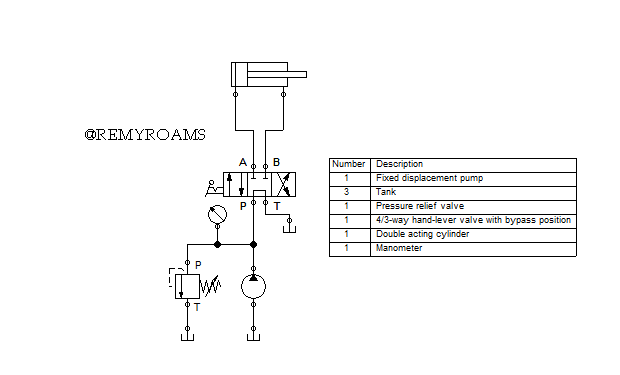
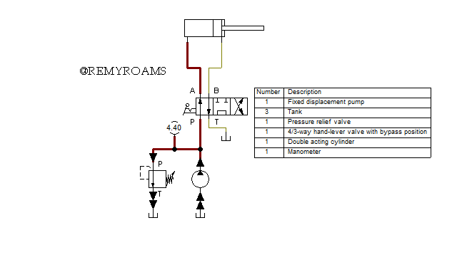
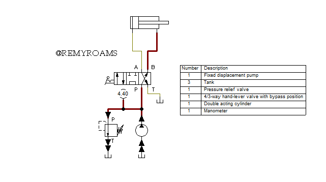

# 🛢 Limiting Maximum Pressure using a Pressure Relief Valve

## Overview

🔹 In order to lessen to impact of the system being subjected to the pump's maximum operating pressure, a pressure relief valve has been added after the pump discharge.

## Hydraulic Diagrams

Hydraulic Circuit Diagram

Extended Position	

Initial Retracting Position

## Bill of Materials

| Number                            | Description         |
|:---------------------------------:|---------------------|
|1|Fixed displacement pimp|
|1|Tank|
|1|Pressure relief valve|
|1|4/3-way hand-lever valve with bypass position|
|1|Double acting cylinder|
|3|Manometer|

## Flow of Hydraulic Oil

🔹 The system has a maximimun operating pressure of 6 MPa dictated by the pump.
🔹 In order to esure safe operaion and protection the components, a pressure relief valve has been set to have a cracking pressure of 4 Mpa