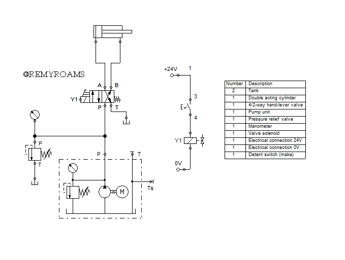
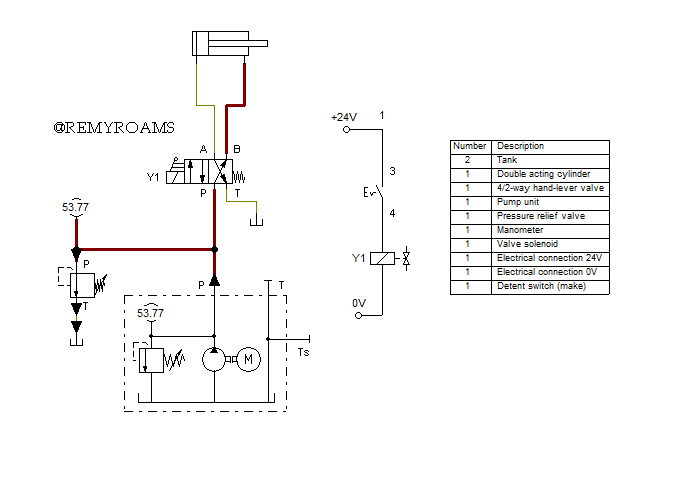
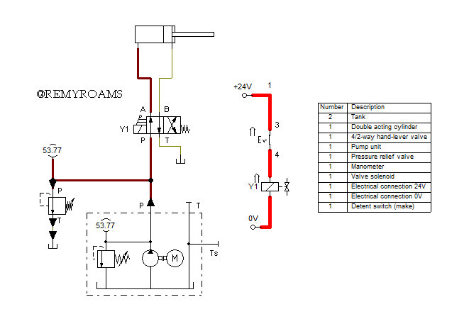

# 🛢 A Double Acting Cylinder with a 4-2 Way Valve and a Solenoid

## Overview

🔹 Creating a hydraulic diagram controlling a double acting cylinder with a 4/2 way valve and a solenoid.   
🔹 Combining hands-on work experience w/ theory.  

## Hydraulic Diagrams

Hydraulic Circuit Diagram

Initial State

Engaged State

## Bill of Materials

## Flow of Hydraulic Oil