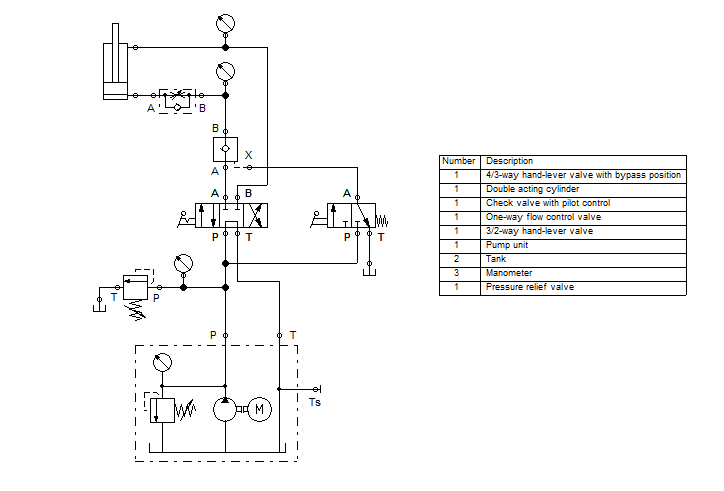
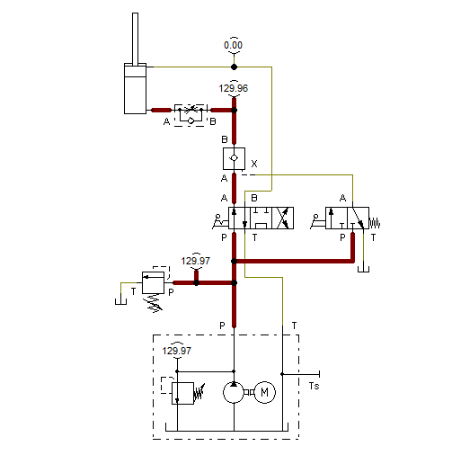
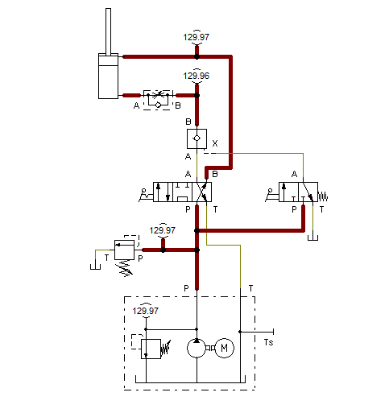
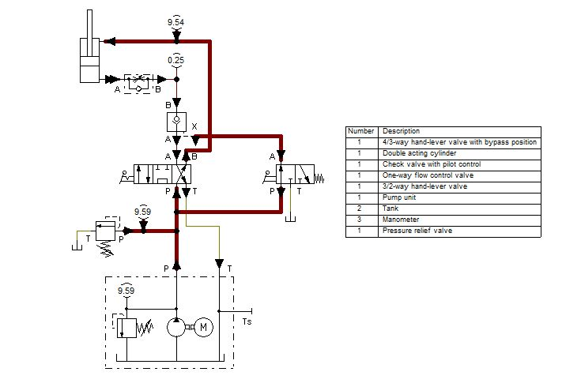

# 🛢 A Double Acting Cylinder with a Pilot Valve for Retraction

## Overview

🔹 Creating a hydraulic diagram controlling a double acting cylinder with a pilot valve for retraction.  
🔹 Simulating a heavy equipment.

## Hydraulic Diagrams

Hydraulic Circuit Diagram

Extended Position	

Initial Retracting Position

Retraction using a Pilot

## Bill of Materials

| Number                            | Description         |
|:---------------------------------:|---------------------|
|1|4/3-way hand-lever valve with bypass position|
|1|Double acting cylinder|
|1|Check valve with pilot control|
|1|One-way flow control valve|
|1|3/2-way hand-lever valve|
|1|Pump unit|
|2|Tank|
|3|Manometer|
|1|Pressure relief valve|

## Flow of Hydraulic Oil
