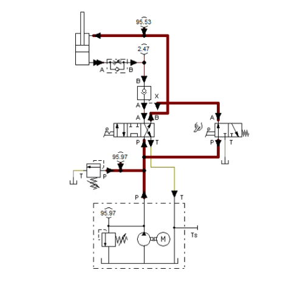

# 🛢 A Double Acting Cylinder with a Pilot Valve for Retraction

## Overview

🔹 Creating a hydraulic diagram controlling a double acting cylinder with a pilot valve for retraction.  
🔹 Simulating a heavy equipment.

## Hydraulic Diagrams

Hydraulic Circuit Diagram

Extended Position	

Retracted Position

Retraction using a Pilot Valve

## Bill of Materials

## Flow of Hydraulic Oil

